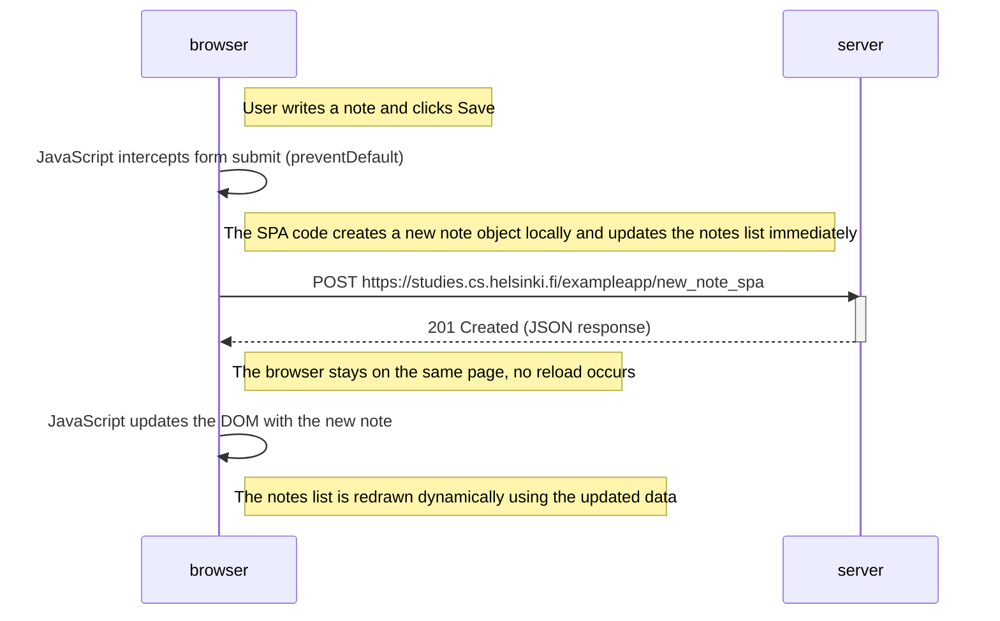

```mermaid
sequenceDiagram
    participant browser
    participant server

    Note right of browser: User writes a note and clicks Save

    browser->>browser: JavaScript intercepts form submit (preventDefault)
    Note right of browser: The SPA code creates a new note object locally and updates the notes list immediately

    browser->>server: POST https://studies.cs.helsinki.fi/exampleapp/new_note_spa
    activate server
    server-->>browser: 201 Created (JSON response)
    deactivate server

    Note right of browser: The browser stays on the same page, no reload occurs

    browser->>browser: JavaScript updates the DOM with the new note
    Note right of browser: The notes list is redrawn dynamically using the updated data
```
